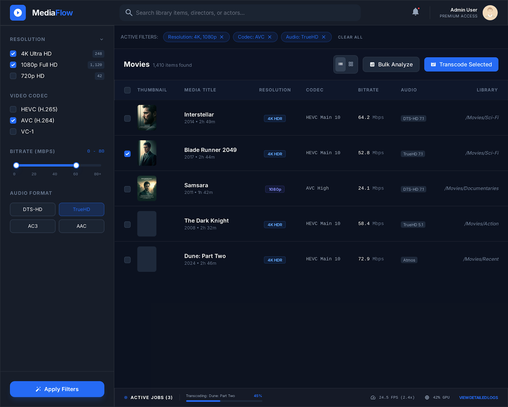
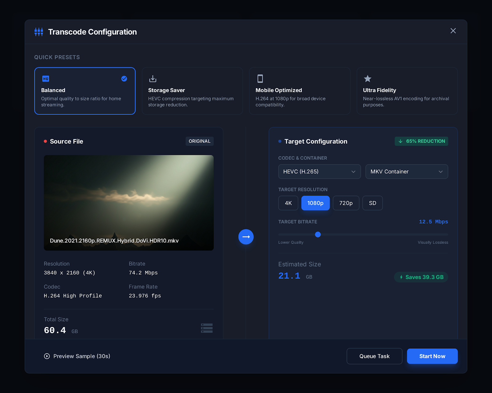
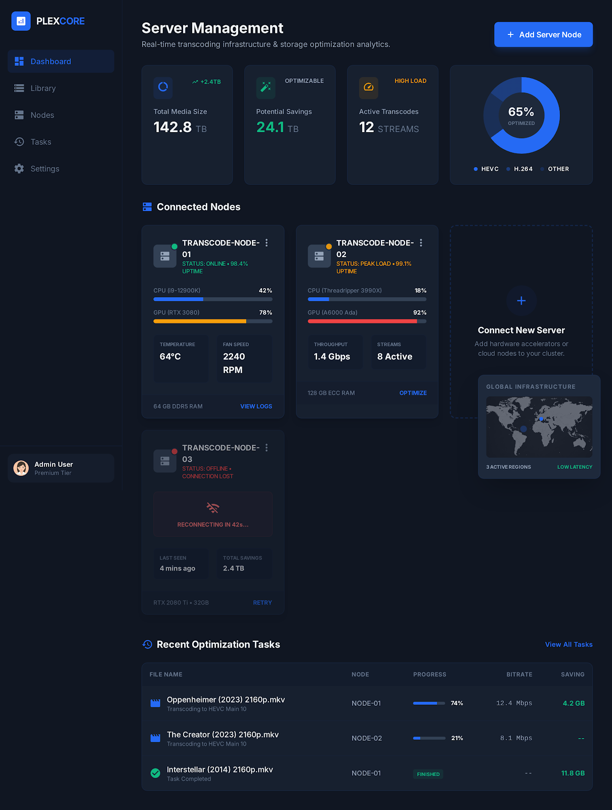
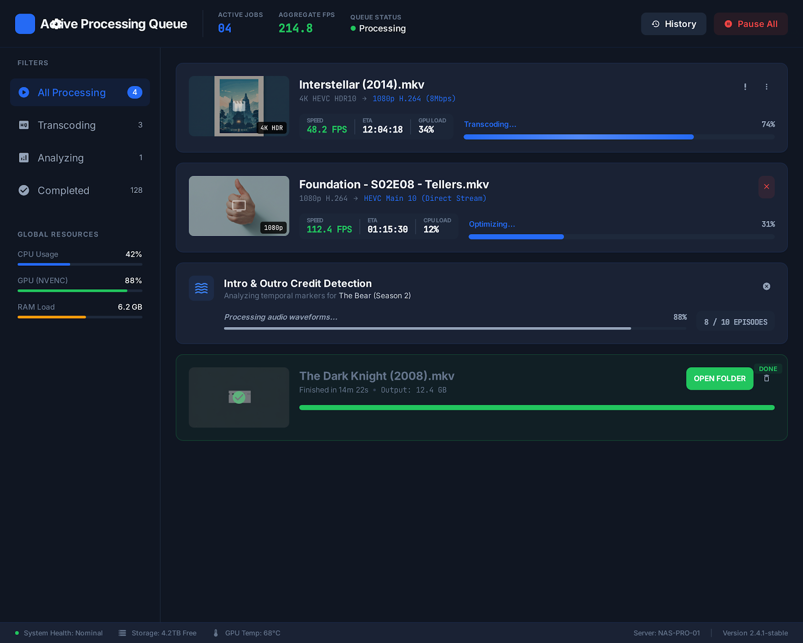

<p align="center">
  
</p>

<h1 align="center">MediaFlow</h1>

<p align="center">
  <strong>Intelligent Plex media library optimizer & distributed transcoding engine for macOS</strong>
</p>

<p align="center">
  
  
  
  
  
  
</p>

<br />

<p align="center">
  
</p>

<br />

MediaFlow connects to your Plex servers, analyzes every file in your library, and gives you the tools to modernize codecs, reclaim storage, and orchestrate transcoding across local and cloud hardware — all from a native macOS app with real-time progress.

---

## Highlights

- **Full library visibility** — browse every file with codec, resolution, bitrate, HDR, and audio metadata at a glance
- **AI-driven recommendations** — five analyzers identify exactly which files to transcode and how much space you'll save
- **Distributed transcoding** — fan out jobs across your Mac, remote Linux servers, and on-demand cloud GPUs simultaneously
- **Cloud GPU on demand** — deploy Vultr A16/A40 instances with one click, auto-teardown on idle, spend cap enforcement
- **NVENC hardware encoding** — automatic CPU-to-GPU codec upgrade with 14x speedup (561 FPS vs 40 FPS on hevc_nvenc)
- **Bulk operations** — select all filtered results across pages and queue hundreds of transcodes in a single action
- **Real-time monitoring** — WebSocket-driven progress bars, encoding speed, ETA, and server metrics updating live
- **Safety first** — dry-run simulation, integrity verification, automatic backup, and rollback support

---

## Features

### Library Analysis & Filtering

Connect to one or more Plex servers via OAuth and sync your entire media catalog. Browse every file with full technical metadata and powerful compound filters.

<p align="center">
  
</p>

- **Resolution** (4K, 1080p, 720p, SD) with HDR/SDR indicators
- **Video codec** (H.264, H.265, AV1, VP9, VC1, MPEG4)
- **Audio tracks** (Atmos, DTS-X, TrueHD, AC3, AAC, FLAC) with channel counts
- **Bitrate**, file size, duration, container format, frame rate
- **Advanced compound filters** — combine resolution + codec + bitrate + library + size range
- **Cross-page bulk selection** — "Select All Filtered" grabs every matching item, not just the current page
- **CSV/JSON export** of any filtered view

### Transcode Configuration

Full control over the encoding pipeline with four built-in presets and complete manual override.

<p align="center">
  
</p>

- **Video** — resolution scaling, codec selection (H.264, H.265, AV1), CRF or target bitrate
- **Audio** — copy/passthrough, transcode to AAC/AC3, downmix, multi-track handling
- **HDR** — preserve HDR10/Dolby Vision or tone-map to SDR
- **Hardware acceleration** — auto-detect NVENC, QuickSync, VideoToolbox
- **Two-pass encoding**, custom FFmpeg flags, encoder-specific tuning

| Preset | Use Case |
|--------|----------|
| **Balanced** | Good quality-to-size ratio for general use |
| **Storage Saver** | Maximum compression for bulk libraries |
| **Mobile Optimized** | 720p / lower bitrate for mobile streaming |
| **Ultra Fidelity** | Archive-grade quality preservation |

### Intelligence Engine

Five built-in recommendation analyzers scan your library and surface actionable insights with estimated savings per file.

| Analyzer | What It Finds |
|----------|---------------|
| **Codec Modernization** | H.264/MPEG4/VC1 files that benefit from H.265 conversion |
| **Quality Overkill** | 4K HDR content with minimal views — candidates for space-saving downscale |
| **Duplicate Detection** | Same content in multiple qualities or formats across libraries |
| **Quality Gap Analysis** | Files with bitrates far below your library average |
| **Storage Optimization** | Prioritized savings opportunities with estimated GB reclaimed per file |

One-click **batch queue** sends all accepted recommendations straight to the transcode pipeline.

### Distributed Worker System

Scale transcoding across multiple machines with intelligent job scheduling.

<p align="center">
  
</p>

- **Local macOS worker** — auto-configured, zero setup
- **Remote Linux servers** — add any Ubuntu/Debian/RHEL VPS via SSH
- **One-click provisioning** — MediaFlow SSHs into a fresh server and installs FFmpeg + GPU drivers automatically
- **Intelligent scheduling** — composite scoring based on CPU/GPU load (35%), historical performance (30%), and transfer cost (35%)
- **Network benchmarking** — upload/download speed tests feed into the scheduling algorithm
- **Auto-failover** — detects offline workers and reassigns jobs

#### File Transfer Modes

| Mode | When Used |
|------|-----------|
| **Local** | Worker has direct filesystem access |
| **Mapped Paths** | Worker sees Plex files via network mount (NFS/SMB) |
| **SSH Pull** | Download source from NAS, transcode locally, upload result back |

Auto-detected with fallback chain. Path mappings are configurable per server.

### Cloud GPU Transcoding

Deploy GPU compute on demand from directly within the app. No manual server setup required.

- **One-click deploy** — pick a GPU plan (Vultr A16/A40), region, and idle timeout
- **Automatic provisioning** — creates instance, polls until active, SSHs in, installs FFmpeg + tests NVENC
- **NVENC auto-upgrade** — CPU codecs are automatically swapped to GPU equivalents (`libx265` -> `hevc_nvenc`)
- **Idle auto-teardown** — configurable timeout destroys instances when no jobs are running
- **Spend caps** — monthly and per-instance caps with automatic enforcement
- **Cost tracking** — per-job and per-instance cost recorded with full analytics
- **vGPU compatibility** — auto-detects NVENC SDK version and falls back to compatible FFmpeg build

| GPU Plan | VRAM | Approx. Cost |
|----------|------|-------------|
| A16 1x | 16 GB | ~$0.47/hr |
| A40 1/3 | 16 GB | ~$0.58/hr |
| A40 1/2 | 24 GB | ~$0.86/hr |

### Real-Time Processing Queue

Everything updates live via WebSocket — no polling, no refresh.

<p align="center">
  
</p>

- **Progress bars** with percentage, encoding speed (FPS), and ETA per job
- **Server metrics** — CPU, GPU, RAM, temperature per worker
- **Queue stats** — pending, active, completed counts with aggregate FPS
- **Job logs** — expandable FFmpeg output for debugging
- **Toast notifications** — real-time alerts for job completion, errors, and cloud events
- **Health monitoring** — automatic detection of offline workers

### Analytics Dashboard

Track the impact of your optimization work over time.

- **Total storage saved** across all completed transcodes
- **Codec distribution** breakdown across your library
- **Resolution breakdown** with HDR counts
- **Job history** with per-file size reduction and timing
- **Cloud cost tracking** — hourly rate, total spend, cost per job
- **Savings trends** over 30/90/365 day windows

---

## Architecture

```
┌─────────────────────────────────┐
│     macOS SwiftUI Frontend      │
│   (MVVM, native dark theme)     │
│                                 │
│  Library ─ Transcode ─ Servers  │
│  Analytics ─ Recommendations    │
└──────────────┬──────────────────┘
               │ REST + WebSocket
               ▼
┌─────────────────────────────────┐
│     Python FastAPI Backend      │
│       (port 9876, async)        │
│                                 │
│  API Routes ─ Services ─ ORM   │
│  Workers ─ Scheduler ─ SSH     │
└──────┬───────────┬──────────────┘
       │           │
       ▼           ▼
┌────────────┐  ┌──────────────────┐
│   SQLite   │  │  Worker Servers  │
│  (WAL mode)│  │                  │
│            │  │  Local macOS     │
│  15 tables │  │  Remote Linux    │
│            │  │  Cloud GPU (A16) │
└────────────┘  └──────────────────┘
                       │ SSH
                       ▼
                ┌──────────────┐
                │  Plex Server │
                │  (NAS / VM)  │
                └──────────────┘
```

---

## Tech Stack

| Layer | Technology |
|-------|-----------|
| **Frontend** | SwiftUI, AppKit (NSPanel), Combine — zero external dependencies |
| **Backend** | FastAPI, SQLAlchemy 2.0 (async), Pydantic v2, Uvicorn |
| **Database** | SQLite with WAL mode, async via aiosqlite |
| **SSH** | asyncssh for remote command execution and SFTP transfers |
| **Transcoding** | FFmpeg/FFprobe (static builds for remote workers, Jellyfin build for vGPU) |
| **Cloud** | Vultr v2 REST API (httpx async) for on-demand GPU instances |
| **Real-time** | Native WebSocket with pub/sub event system |

---

## Getting Started

### Prerequisites

- **macOS 14+** (Sonoma or later)
- **Python 3.11+** with pip
- **Swift 5.9+** (included with Xcode 15+)
- **FFmpeg** (installed locally for the local worker — `brew install ffmpeg`)
- A **Plex Media Server** with a valid account

### Installation

```bash
# Clone the repository
git clone https://github.com/bytePatrol/MediaFlow.git
cd MediaFlow

# Set up the Python backend
cd backend
python3 -m venv venv
source venv/bin/activate
pip install -r requirements.txt
cd ..

# Build the Swift frontend
cd frontend/MediaFlow
swift build
cd ../..
```

### Running

The easiest way to launch both services:

```bash
./run.sh
```

This starts the FastAPI backend on port 9876 and builds + launches the SwiftUI app.

You can also run them independently:

```bash
# Backend only
./run.sh --backend-only

# Frontend only (requires backend running)
./run.sh --frontend-only
```

Or manually:

```bash
# Terminal 1: Backend
cd backend
source venv/bin/activate
uvicorn app.main:app --port 9876 --reload

# Terminal 2: Frontend
cd frontend/MediaFlow
swift build && .build/debug/MediaFlow
```

### First Launch

1. Open MediaFlow — the app connects to the backend automatically
2. Go to **Settings** and sign in with your Plex account (OAuth)
3. Your servers and libraries sync automatically
4. Navigate to the **Library** tab to browse your media
5. Head to **Servers** to add remote workers or deploy a cloud GPU

---

## API

The backend exposes a full REST API on `http://localhost:9876`. Interactive docs available at:

- **Swagger UI**: [http://localhost:9876/docs](http://localhost:9876/docs)
- **ReDoc**: [http://localhost:9876/redoc](http://localhost:9876/redoc)

| Prefix | Description |
|--------|-------------|
| `/api/plex` | Plex OAuth, server management, library sync |
| `/api/library` | Media queries, filtering, statistics, bulk ID lookup, export |
| `/api/transcode` | Job creation, queue management, dry-run |
| `/api/presets` | Encoding preset CRUD |
| `/api/servers` | Worker servers, provisioning, benchmarks |
| `/api/cloud` | Cloud GPU deploy/teardown, plans, cost tracking, settings |
| `/api/analytics` | Storage savings, codec distribution, job history |
| `/api/recommendations` | Intelligent analysis and batch queueing |
| `/api/settings` | App configuration, path mappings |
| `/api/logs` | Log retrieval and system diagnostics |
| `/ws` | WebSocket for real-time updates |

---

## Project Structure

```
MediaFlow/
├── backend/
│   ├── app/
│   │   ├── main.py                 # FastAPI app with lifespan
│   │   ├── config.py               # Environment-based settings
│   │   ├── database.py             # SQLAlchemy engine + migrations
│   │   ├── api/                    # Route handlers (14 modules)
│   │   ├── models/                 # ORM models (15 tables)
│   │   ├── schemas/                # Pydantic request/response schemas
│   │   ├── services/               # Business logic + Vultr client
│   │   ├── workers/                # Background processors (5 workers)
│   │   └── utils/                  # SSH, FFmpeg, FFprobe, path resolution
│   ├── requirements.txt
│   └── .env.example
├── frontend/MediaFlow/
│   ├── Package.swift               # SPM config (macOS 14+)
│   └── MediaFlow/
│       ├── App/                    # Entry point, app state
│       ├── Models/                 # Codable data models
│       ├── ViewModels/             # ObservableObject view models
│       ├── Views/                  # SwiftUI views by feature
│       ├── Services/               # Backend API + WebSocket clients
│       ├── Networking/             # HTTP + WebSocket layers
│       ├── Theme/                  # Color system, typography
│       ├── Utilities/              # Keychain, logging, debouncing
│       └── Extensions/             # View + formatter helpers
├── sample_designs/                 # UI reference designs
├── run.sh                          # Dev launcher
└── project_description.md          # Full specification
```

---

## Configuration

```bash
cp backend/.env.example backend/.env
```

| Variable | Default | Description |
|----------|---------|-------------|
| `DATABASE_URL` | `sqlite+aiosqlite:///./mediaflow.db` | Database connection string |
| `SECRET_KEY` | `change-me-to-a-random-secret-key` | App secret for signing |
| `CORS_ORIGINS` | `["http://localhost:9876"]` | Allowed CORS origins |
| `LOG_LEVEL` | `INFO` | Logging verbosity |

Cloud GPU and path mapping settings are configured in-app via **Settings**.

---

## License

This project is licensed under the MIT License. See [LICENSE](LICENSE) for details.
