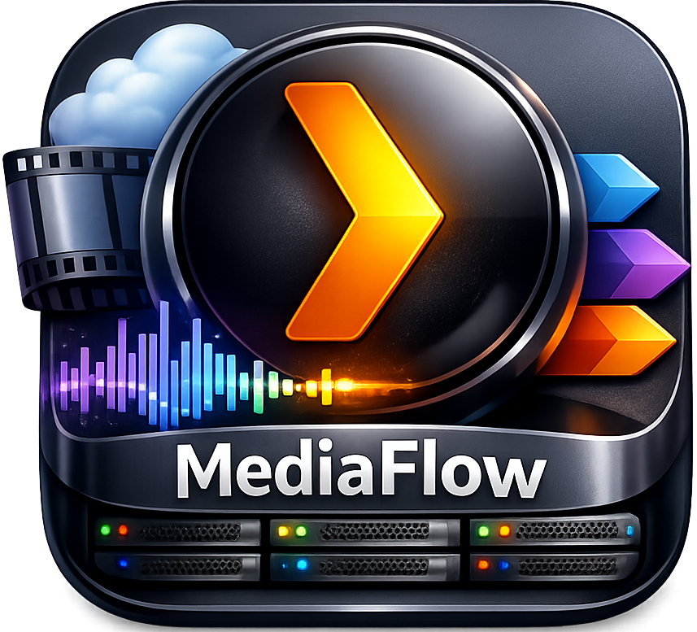

<p align="center">
  
</p>

<h1 align="center">MediaFlow</h1>

<p align="center">
  <strong>The intelligent Plex media library optimizer & distributed transcoding engine for macOS</strong>
</p>

<p align="center">
  
  
  
  
  
  
  
</p>

<br />

MediaFlow connects to your Plex servers, analyzes every file in your library, and gives you the tools to modernize codecs, reclaim storage, and orchestrate transcoding across local and cloud hardware — all from a native macOS app with real-time progress, VMAF quality validation, smart automation, and premium analytics.

---

## Table of Contents

- [Why MediaFlow?](#why-mediaflow)
- [Features](#features)
  - [Library Management & Media Detail](#library-management--media-detail)
  - [Intelligence Engine](#intelligence-engine)
  - [Smart Automation & Workflows](#smart-automation--workflows)
  - [Quality Assurance (VMAF)](#quality-assurance-vmaf)
  - [Transcode Configuration](#transcode-configuration)
  - [Processing Queue](#processing-queue)
  - [Distributed Worker System](#distributed-worker-system)
  - [Cloud GPU Transcoding](#cloud-gpu-transcoding)
  - [Premium Analytics](#premium-analytics)
  - [Command Palette](#command-palette)
  - [Quick Transcode](#quick-transcode)
  - [Notifications](#notifications)
- [Architecture](#architecture)
- [Tech Stack](#tech-stack)
- [Getting Started](#getting-started)
- [API Reference](#api-reference)
- [Project Structure](#project-structure)
- [Configuration](#configuration)
- [Database Schema](#database-schema)
- [License](#license)

---

## Why MediaFlow?

| | |
|---|---|
| **Full library visibility** | Browse every file with codec, resolution, bitrate, HDR, audio metadata, play count, and transcode history at a glance |
| **Intelligent recommendations that learn** | 9 analyzers generate recommendations with cost-benefit analysis, ROI scoring, and confidence levels — the system learns from your feedback and gets smarter over time |
| **Viewing-pattern awareness** | Recommendations factor in Plex play counts and last-watched dates — aggressive compression for unwatched content, conservative for favorites |
| **VMAF quality validation** | Every transcode can be scored with Netflix's perceptual quality metric (0-100) with visual A/B frame comparison |
| **Set-and-forget automation** | Trigger → condition → action rules that analyze, queue, and transcode automatically. One-click library optimization. |
| **4 queue strategies** | FIFO, biggest savings first, fastest jobs first, or most-watched first — plus drag-and-drop manual reordering |
| **Distributed transcoding** | Fan out jobs across your Mac, remote Linux servers, and on-demand cloud GPUs simultaneously |
| **Cloud GPU on demand** | Deploy Vultr A16/A40 instances with one click — auto-teardown on idle, spend cap enforcement, full cost analytics |
| **NVENC hardware encoding** | Automatic CPU-to-GPU codec upgrade with 14x speedup (561 FPS vs 40 FPS on hevc_nvenc) |
| **Premium analytics suite** | Library health grades, codec migration tracking, cost analytics, worker heatmaps, job timelines, storage projections, and PDF reports |
| **6 notification channels** | Push (macOS banners), email, Discord, Slack, Telegram, and webhooks — all triggerable from automation rules |
| **Command palette** | `⌘K` for instant media search, navigation, library-scoped actions, and recent action replay |
| **Real-time everything** | WebSocket-driven progress bars, encoding speed, ETA, and server metrics — no polling |
| **Completely free** | No subscription, no premium tier, no feature gates — every feature is included |

---

## Features

### Library Management & Media Detail

Connect to one or more Plex servers via OAuth and sync your entire media catalog. Browse every file with full technical metadata, powerful compound filters, and deep item inspection.

- **Resolution** (4K, 1080p, 720p, SD) with HDR/SDR indicators
- **Video codec** (H.264, H.265, AV1, VP9, VC1, MPEG4)
- **Audio tracks** (Atmos, DTS-X, TrueHD, AC3, AAC, FLAC) with channel counts
- **Bitrate**, file size, duration, container format, frame rate, play count, last watched
- **Advanced compound filters** — combine resolution + codec + bitrate + library + size range
- **Saved filter presets** — save, load, and delete filter configurations
- **Cross-page bulk selection** — "Select All Filtered" grabs every matching item, not just the current page
- **Custom tagging** — create color-coded tags, bulk apply/remove, filter by tag
- **Collection builder** — create Plex collections from filtered selections
- **Drag-and-drop** — drop video files onto the sidebar to jump straight to Quick Transcode
- **CSV/JSON export** of any filtered view

#### Media Item Detail Panel

Click any media item to open a comprehensive detail panel:

- **Full metadata** — resolution, codec, bitrate, container, duration, file size, full path
- **Audio & subtitle tracks** — every track with codec, language, and channel layout
- **Transcode history** — every past job for this file with status, codec change, size reduction, VMAF score, and date
- **Recommendation status** — active recommendations with type, priority, estimated savings, and status (pending/queued/dismissed)
- **Quick transcode** — start a transcode directly from the detail panel

### Intelligence Engine

Nine built-in recommendation analyzers scan your library and surface actionable insights with cost-benefit analysis, ROI scoring, confidence levels, and viewing-pattern awareness.

| Analyzer | What It Finds |
|----------|---------------|
| **Codec Modernization** | H.264/MPEG4/VC1 files that benefit from H.265/AV1 conversion |
| **Quality Overkill** | Files with excessively high bitrates relative to their resolution |
| **Duplicate Detection** | Same content in multiple qualities or formats across libraries |
| **Quality Gap Analysis** | Files with bitrates far below your library average |
| **Storage Optimization** | Largest files with lowest engagement — top candidates for compression |
| **Audio Optimization** | Lossless high-channel audio (TrueHD, DTS-HD MA) eligible for downmix |
| **Container Modernize** | Legacy containers (.avi, .wmv, .mpg) for fast remux to .mkv |
| **HDR to SDR** | Low-usage HDR content for tone-mapped SDR conversion |
| **Viewing Pattern** | Recommendations based on how you actually watch — aggressive for unwatched, conservative for favorites |

#### Cost-Benefit Analysis

Every recommendation includes a detailed breakdown:

- **Estimated file size savings** (e.g., "Save 4.2 GB")
- **Transcode duration** based on historical FPS for that codec pair
- **Cloud GPU cost** if using cloud workers (e.g., "$0.12")
- **ROI score** (e.g., "35x ROI" = $0.12 GPU cost to save 4.2 GB)
- **Confidence level** — learned (high) vs estimated (lower)

Sort recommendations by ROI to find the most cost-effective optimizations.

#### Preference Learning

The Intelligence system learns from your feedback and gets smarter over time:

- **Dismiss with reason** — tell the system "don't touch 4K", "keep original codec", or "file too important"
- **Type suppression** — if you dismiss >70% of a recommendation type, it stops suggesting them
- **Resolution rules** — dismiss 4K transcodes 3+ times and the system learns to skip 4K content
- **Savings calibration** — actual compression ratios from completed jobs refine future estimates
- **Automatic filtering** — learned preferences are applied before recommendations are shown

#### Per-Library Scoping

- Filter recommendations, summaries, and analysis history to any individual Plex library
- Library-specific analysis with dedicated summary and top opportunities
- Analysis history shows which libraries were analyzed with library badges

#### Intelligent Estimation Pipeline

1. **Learned ratios** — actual compression ratios from your completed jobs (min 3 samples per codec pair, 90% confidence)
2. **Default ratios** — curated codec-pair tables (50% confidence)
3. **Bitrate analysis** — compares file bitrate to resolution reference (30% confidence)
4. **Fallback** — conservative 40% estimate (20% confidence)

### Smart Automation & Workflows

Create trigger-based rules that keep your library optimized automatically — zero manual intervention required.

#### Automation Rules Engine

Each rule consists of a **trigger**, optional **conditions**, and an **action**:

| Triggers | Actions |
|----------|---------|
| Analysis complete | Queue top N recommendations |
| Job complete | Run analysis |
| Job failed | Send notification |
| Library sync | Pause queue |
| Storage threshold | Deploy cloud GPU |
| Schedule (cron) | |

**Conditions** filter triggers with comparisons (>, <, =, contains) on any event field — e.g., "only when savings > 50 GB" or "only for high-priority jobs."

**Example rules:**
- *"When analysis completes and savings > 50 GB, auto-queue top 20 recommendations"*
- *"When a job fails, send a Discord notification"*
- *"When library syncs, run analysis"*
- *"When storage free < 10%, pause queue and send alert"*

Each rule shows trigger count, last fired timestamp, and can be enabled/disabled with a toggle.

#### One-Click Optimize

A single button chains: **sync** → **analyze** → **queue high-confidence recommendations** → **transcode**. The fastest way to bring a library up to date.

#### Additional Automation

- **Scheduled library scans** — configurable interval (6h / 12h / daily / weekly) with optional post-sync analysis
- **Sonarr/Radarr webhooks** — `POST /api/webhooks/ingest/{source_id}` auto-creates transcode jobs when new media arrives
- **Folder watching** — monitor directories for new media files, auto-queue with configurable preset and delay
- **Cloud auto-deploy** — automatically spin up a cloud GPU when jobs queue with no workers available
- **Auto-analyze on sync** — intelligence analysis runs automatically after library sync

### Quality Assurance (VMAF)

Build trust that transcoding preserves quality with Netflix's perceptual quality metric.

#### VMAF Quality Scoring

- After transcode, MediaFlow runs `ffmpeg -lavfi libvmaf` to compute a 0–100 perceptual quality score
- Scores stored per job and displayed as badges: **"98.2 VMAF — Excellent"**
- Color-coded: 95+ green (excellent), 90-95 blue (very good), 80-90 orange (good), <80 red (quality concern)
- Visible on job cards, media detail panels, and the VMAF Dashboard

#### Visual A/B Comparison

- Side-by-side frame captures from original and transcoded files at matching timestamps
- Metadata comparison: codec, resolution, file size, bitrate, and VMAF score for both versions
- See exactly what changed: *"1.8 GB → 420 MB (77% smaller), VMAF 96.7"*

#### VMAF Validation Dashboard

- **Average quality score** across all scored transcodes
- **Per-codec-pair breakdown** — which conversions retain the most quality (e.g., H.264→HEVC averages 96.3)
- **Score distribution** — total scored jobs, min/max scores
- Spot problematic presets before they affect your library

### Transcode Configuration

Full control over the encoding pipeline with four built-in presets and complete manual override.

- **Video** — resolution scaling, codec selection (H.264, H.265, AV1), CRF or target bitrate
- **Audio** — copy/passthrough, transcode to AAC/AC3, downmix, multi-track handling
- **HDR** — preserve HDR10/Dolby Vision or tone-map to SDR
- **Hardware acceleration** — auto-detect NVENC, QuickSync, VideoToolbox
- **Two-pass encoding**, custom FFmpeg flags, encoder-specific tuning
- **Preset import/export** — share encoding configurations as JSON

| Preset | Use Case |
|--------|----------|
| **Balanced** | Good quality-to-size ratio for general use |
| **Storage Saver** | Maximum compression for bulk libraries |
| **Mobile Optimized** | 720p / lower bitrate for mobile streaming |
| **Ultra Fidelity** | Archive-grade quality preservation |

#### Codec Strategy Advisor

Don't know which codec to target? The Codec Strategy Advisor analyzes your completed transcode history and recommends the optimal target for each library:

- **Per-library recommendations** based on actual compression ratios from your data
- **Per-resolution breakdowns** — 4K content may benefit more from AV1 than 1080p does
- **Projected savings** if you follow the recommended strategy
- Recommendations improve over time as more jobs complete

### Processing Queue

Everything updates live via WebSocket — no polling, no refresh.

- **Progress bars** with percentage, encoding speed (FPS), and ETA per job
- **Pre-upload indicators** — shows upload progress on the next queued job while the current one transcodes
- **Server metrics** — CPU, GPU, RAM, temperature per worker
- **Queue stats** — pending, active, completed counts with aggregate FPS
- **Job logs** — expandable FFmpeg output for debugging
- **Auto-retry** — failed jobs retry with exponential backoff (1/5/15 min), configurable max retries
- **Stuck detection** — health worker flags stalled jobs after configurable timeout
- **Post-transcode validation** — ffprobe verifies output has video streams, correct file size, and matching duration

#### 4 Queue Priority Strategies

| Strategy | How It Works |
|----------|-------------|
| **First In, First Out** | Default — jobs processed in queue order |
| **Biggest Savings First** | Large files yielding the most storage savings go first |
| **Fastest Jobs First** | Small files for quick wins and rapid progress |
| **Most Watched First** | Frequently-viewed content gets optimized first |

Switch strategies via the dropdown in the queue header. Your preference persists across sessions.

#### Drag-and-Drop Reordering

Queued jobs can be reordered by dragging:

- **Drag handles** on each queued job card
- **Position badges** (#1, #2, #3) update in real-time
- **Drop target highlighting** shows where the job will land
- **Backend persistence** — new order is saved immediately
- Manual reordering takes precedence over the selected strategy

### Distributed Worker System

Scale transcoding across multiple machines with intelligent job scheduling.

- **Local macOS worker** — auto-configured, zero setup
- **Remote Linux servers** — add any Ubuntu/Debian/RHEL VPS via SSH
- **One-click provisioning** — MediaFlow SSHs into a fresh server and installs FFmpeg + GPU drivers automatically
- **Intelligent scheduling** — composite scoring based on CPU/GPU load (35%), historical performance (30%), and transfer cost (35%)
- **Network benchmarking** — upload/download speed tests feed into the scheduling algorithm
- **Auto-failover** — detects offline workers and reassigns jobs
- **Pre-upload pipeline** — while the GPU transcodes the current job, automatically starts uploading the next job's source file
- **Parallel multi-stream SSH** — 4-stream parallel transfers for files >100MB with hardware-accelerated AES-NI cipher

#### File Transfer Modes

| Mode | When Used |
|------|-----------|
| **Local** | Worker has direct filesystem access |
| **Mapped Paths** | Worker sees Plex files via network mount (NFS/SMB) |
| **SSH Pull** | Download source from NAS, transcode locally, upload result back |

Auto-detected with fallback chain. Path mappings are configurable per server and globally.

### Cloud GPU Transcoding

Deploy GPU compute on demand from directly within the app. No manual server setup required.

- **One-click deploy** — pick a GPU plan (Vultr A16/A40), region, and idle timeout
- **Automatic provisioning** — creates instance, polls until active, SSHs in, installs FFmpeg + tests NVENC
- **NVENC auto-upgrade** — CPU codecs are automatically swapped to GPU equivalents (`libx265` → `hevc_nvenc`)
- **NVENC failure fallback** — 2-stage: drops CUDA decode first, then falls back to full CPU encoding
- **Idle auto-teardown** — configurable timeout destroys instances when no jobs are running
- **Auto-deploy** — optionally deploy a cloud GPU automatically when jobs queue with no workers available (also available as an automation rule action)
- **Spend caps** — monthly and per-instance caps with automatic enforcement
- **Cost tracking** — per-job and per-instance cost recorded with full analytics
- **vGPU compatibility** — auto-detects NVENC SDK version and falls back to compatible FFmpeg build (Jellyfin)
- **Orphan detection** — on startup, checks Vultr API for instances not matching any worker

| GPU Plan | VRAM | Approx. Cost |
|----------|------|-------------|
| A16 1x | 16 GB | ~$0.47/hr |
| A40 1/3 | 16 GB | ~$0.58/hr |
| A40 1/2 | 24 GB | ~$0.86/hr |

### Premium Analytics

A comprehensive analytics suite with animated KPI counters, interactive charts, and detailed breakdowns across 8 dashboard views.

#### Core Dashboard

- **Library health score** — weighted 0–100 grade (codec modernity 40%, bitrate appropriateness 30%, container format 15%, audio efficiency 15%) with animated circular gauge and letter grade A–F
- **Animated KPI cards** — numbers count up smoothly on page load. Total media size, total savings, completed jobs, workers online — each with week-over-week sparklines
- **Savings predictions** — animated 30/90/365-day forecasts based on your transcoding pace
- **Charts** — savings over time, codec distribution donut, resolution bar chart, storage timeline
- **Interactive chart tooltips** — drag across charts for point-in-time details
- **Time range filtering** — 7d / 30d / 90d / 1y across all dashboard views
- **PDF health reports** — downloadable library health report

#### Library Health Report

Per-library health grades that answer *"which library should I tackle first?"*

- **Health grade** (A–F) per library based on codec efficiency and optimization coverage
- **Modern codec percentage** — what % of each library uses HEVC/AV1
- **Top codecs** breakdown per library
- **Potential savings** highlighted when significant
- **Item count and total size** per library

#### Codec Migration Tracker

Track your library-wide modernization progress over time:

- **Color-coded stacked bar** — HEVC (green), AV1 (blue), H.264 (orange), legacy (red)
- **Modern codec percentage** — single headline number showing your progress
- **Historical timeline chart** — watch your codec mix evolve week over week
- **Estimated completion** based on current transcoding pace

#### Cost Analytics Dashboard

Understand the true cost of your transcoding operations:

- **Total cloud cost** — cumulative spending across all jobs and instances
- **Cost per GB saved** — efficiency metric (lower = better)
- **Cloud vs. local comparison** — side-by-side cost analysis for the same work
- **Monthly spend projection** — forecast based on current patterns
- **Monthly spend chart** — bar chart showing spending trends

#### Worker Performance Heatmap

Visual grid of worker FPS by hour of day:

- **Workers (Y-axis) × Hours (X-axis)** — color intensity represents FPS
- **Hover tooltips** with exact FPS and job count
- Identify peak performance windows and bottleneck periods
- Spot underperforming workers or time-of-day patterns

#### Job Timeline

Visual Gantt-style timeline showing jobs across workers:

- **Per-worker horizontal bars** sized by job duration
- **Color-coded by status** — green (completed), blue (active), red (failed), gray (queued)
- See parallelization, idle gaps, and transfer overlaps
- Identify bottlenecks: *"Worker B was idle for 20 minutes waiting for upload"*

#### Storage Savings Projection

12-month savings forecast with confidence bands:

- **KPI cards** — current size, projected size, potential savings, monthly pace
- **Confidence bands** — optimistic to conservative range shown as shaded area
- **Monthly breakdown** for precise forecasting

#### Server Performance

- Per-worker stats (FPS, compression ratio, failure rate, cloud badge)
- Top opportunities — ranked list of untranscoded files with estimated savings and one-click queue
- Cloud costs — hourly rate, total spend, cost per job

### Command Palette

Press **`⌘K`** from anywhere for instant access to everything:

- **Navigate** — jump to any page (Library, Processing, Analytics, Intelligence, Settings, etc.)
- **Search media** — type 2+ characters to find media items by title, showing year, codec, and file size
- **Quick actions** — "Sync Libraries", "Run Analysis", "Export PDF Report", "Open Quick Transcode"
- **Library-scoped actions** — type "analyze" to see "Run Analysis for Movies", "Run Analysis for TV Shows", etc.
- **Recent actions** — your last 10 palette actions shown when search is empty for quick replay
- Press **Enter** to execute the first match, **Escape** to dismiss

### Quick Transcode

Transcode arbitrary local files — not just Plex library items — through the same GPU worker infrastructure.

- **Drag-and-drop or file picker** — supports MKV, MP4, AVI, MOV, WMV, TS, M4V, WebM
- **Instant probe** — ffprobe displays resolution, codec, bitrate, duration, audio info before you start
- **Full config** — preset selector, codec/container/resolution/CRF/audio controls, server picker
- **Non-destructive** — output saves as `{name} V2.{ext}` alongside the original

### Notifications

Six fully configurable notification channels, each with per-event toggle control.

| Channel | Setup |
|---------|-------|
| **Push** | macOS native banner notifications — no external service needed |
| **Email** | SMTP configuration with TLS support |
| **Discord** | Webhook URL with color-coded embeds |
| **Slack** | Webhook URL with Block Kit formatting |
| **Telegram** | Bot token + chat ID with Markdown messages |
| **Webhook** | POST JSON to any URL |

**10 event types:** job completed, job failed, analysis completed, server offline, server online, cloud deploy completed, cloud teardown completed, spend cap reached, queue stalled, library sync completed.

Each channel can subscribe to any combination of events. Test buttons for every channel. Full notification history with status tracking. Notifications can also be triggered as automation rule actions.

---

## Architecture

```
┌───────────────────────────────────────────┐
│        macOS SwiftUI Frontend             │
│      (MVVM, native dark theme)            │
│                                           │
│  Library ─ Intelligence ─ Automation      │
│  Processing ─ Analytics ─ Servers         │
│  Quick Transcode ─ Settings ─ Logs        │
│  Command Palette ─ Onboarding ─ Help      │
│  Media Detail ─ Push Notifications        │
└──────────────────┬────────────────────────┘
                   │ REST + WebSocket
                   ▼
┌───────────────────────────────────────────┐
│        Python FastAPI Backend             │
│         (port 9876, async)                │
│                                           │
│  21 API modules ─ 134 endpoints           │
│  16 services ─ 6 background workers       │
│  8 utility modules ─ 22 ORM models        │
└──────────┬──────────────┬─────────────────┘
           │              │
           ▼              ▼
┌──────────────┐  ┌─────────────────────────┐
│    SQLite    │  │    Worker Servers        │
│  (WAL mode)  │  │                         │
│              │  │  Local macOS             │
│  22 tables   │  │  Remote Linux (SSH)      │
│              │  │  Cloud GPU (Vultr A16)   │
└──────────────┘  └─────────────────────────┘
                         │ SSH + SFTP
                         ▼
                  ┌──────────────┐
                  │  Plex Server │
                  │  (NAS / VM)  │
                  └──────────────┘
```

---

## Tech Stack

| Layer | Technology |
|-------|-----------|
| **Frontend** | SwiftUI, AppKit (NSPanel), Combine, Swift Charts — zero external dependencies |
| **Backend** | FastAPI, SQLAlchemy 2.0 (async), Pydantic v2, Uvicorn |
| **Database** | SQLite with WAL mode, async via aiosqlite |
| **SSH** | asyncssh for remote command execution, SFTP, and parallel multi-stream transfers |
| **Transcoding** | FFmpeg/FFprobe with NVENC GPU acceleration and automatic fallback |
| **Quality** | VMAF (libvmaf) for perceptual quality validation |
| **Cloud** | Vultr v2 REST API (httpx async) for on-demand GPU instances |
| **Notifications** | SMTP (aiosmtplib), Discord/Slack/Telegram webhooks, macOS UNUserNotificationCenter |
| **Real-time** | Native WebSocket with pub/sub event system (25+ event types) |

---

## Getting Started

### Prerequisites

- **macOS 14+** (Sonoma or later)
- **Python 3.11+** with pip
- **Swift 5.9+** (included with Xcode 15+ command line tools)
- **FFmpeg** installed locally for the local worker — `brew install ffmpeg`
- A **Plex Media Server** with a valid account

### Installation

#### Option 1: Download the DMG (Recommended)

Download the latest release from the [Releases page](https://github.com/bytePatrol/MediaFlow/releases) and drag MediaFlow.app to your Applications folder.

#### Option 2: Build from Source

```bash
# Clone the repository
git clone https://github.com/bytePatrol/MediaFlow.git
cd MediaFlow

# Set up the Python backend
cd backend
python3 -m venv venv
source venv/bin/activate
pip install -r requirements.txt
cd ..

# Build the Swift frontend
cd frontend/MediaFlow
swift build
cd ../..
```

### Running

The easiest way to launch both services:

```bash
./run.sh
```

This starts the FastAPI backend on port 9876 and builds + launches the SwiftUI app.

You can also run them independently:

```bash
# Backend only
./run.sh --backend-only

# Frontend only (requires backend running)
./run.sh --frontend-only
```

Or manually:

```bash
# Terminal 1: Backend
cd backend
source venv/bin/activate
uvicorn app.main:app --port 9876 --reload

# Terminal 2: Frontend
cd frontend/MediaFlow
swift build && .build/debug/MediaFlow
```

### First Launch

1. Open MediaFlow — the app connects to the backend automatically
2. The **onboarding wizard** walks you through setup: Connect Plex (OAuth) → Add Worker → Ready
3. Your servers and libraries sync automatically after sign-in
4. Navigate to the **Library** tab to browse your media — click any item for full detail
5. Head to **Intelligence** to run your first analysis and see cost-benefit recommendations
6. Go to **Servers** to add remote workers or deploy a cloud GPU
7. Set up **Automation** rules to keep your library optimized automatically
8. Check **Analytics** for health scores, codec migration progress, and storage projections

---

## API Reference

The backend exposes a full REST API on `http://localhost:9876`. Interactive documentation:

- **Swagger UI**: [http://localhost:9876/docs](http://localhost:9876/docs)
- **ReDoc**: [http://localhost:9876/redoc](http://localhost:9876/redoc)

### Endpoints

| Prefix | Module | Endpoints | Description |
|--------|--------|-----------|-------------|
| `/api/health` | health.py | 1 | Health check with version |
| `/api/plex` | plex.py | 10 | OAuth, server management, SSH config, library sync |
| `/api/library` | library.py | 7 | Media queries, filtering, statistics, bulk ID lookup, export |
| `/api/transcode` | transcode.py | 15 | Job CRUD, queue, dry-run, probe, manual transcode, queue strategy, reorder |
| `/api/presets` | presets.py | 7 | Encoding preset CRUD, import/export |
| `/api/servers` | servers.py | 12 | Workers, provisioning, benchmarks, health |
| `/api/cloud` | cloud.py | 6 | GPU deploy/teardown, plans, cost tracking, settings |
| `/api/analytics` | analytics.py | 22 | Overview, trends, predictions, health, sparklines, storage timeline, heatmap, job timeline, codec migration, library health, cost analytics, codec strategy, storage projection, VMAF stats |
| `/api/recommendations` | recommendations.py | 10 | Analysis (full + per-library), batch queue, summary, history, savings, dismiss with reason |
| `/api/automation` | automation.py | 5 | Rule CRUD, toggle, fire |
| `/api/optimize` | optimize.py | 2 | One-click library optimization |
| `/api/comparison` | comparison.py | 2 | Visual A/B comparison data |
| `/api/notifications` | notifications.py | 7 | Channel CRUD, test, events registry, history |
| `/api/settings` | settings.py | 3 | App configuration key-value store |
| `/api/tags` | tags.py | 7 | Custom tag CRUD, bulk apply/remove |
| `/api/collections` | collections.py | 3 | Plex collection builder |
| `/api/filter-presets` | filter_presets.py | 4 | Saved filter preset CRUD |
| `/api/webhooks` | webhooks.py | 5 | Sonarr/Radarr source CRUD + ingest |
| `/api/watch-folders` | watch_folders.py | 5 | Watch folder CRUD + toggle |
| `/api/logs` | logs.py | 3 | Log retrieval, diagnostics, export |
| `/ws` | websocket.py | 1 | WebSocket pub/sub for real-time updates |

**Total: 134 endpoints across 21 modules**

### WebSocket Events

The `/ws` endpoint streams real-time events using a pub/sub model. Key event categories:

| Category | Events |
|----------|--------|
| **Jobs** | `job.progress`, `job.completed`, `job.failed`, `job.preupload_progress` |
| **Cloud** | `cloud.deploy_progress`, `cloud.deploy_completed`, `cloud.deploy_failed`, `cloud.teardown_completed`, `cloud.spend_cap_reached`, `cloud.auto_deploy_triggered`, `cloud.jobs_reassigned` |
| **Library** | `sync.completed`, `analysis.completed` |
| **Queue** | `queue.reordered`, `queue.strategy_changed` |
| **Servers** | `server.offline`, `server.online`, `server.metrics` |
| **Automation** | `automation.rule_fired` |
| **Notifications** | `notification.push` |

---

## Project Structure

```
MediaFlow/
├── backend/
│   ├── app/
│   │   ├── main.py                 # FastAPI app with lifespan
│   │   ├── config.py               # Environment-based settings
│   │   ├── database.py             # SQLAlchemy engine + migrations
│   │   ├── api/                    # Route handlers (21 modules)
│   │   ├── models/                 # ORM models (22 tables)
│   │   ├── schemas/                # Pydantic request/response schemas
│   │   ├── services/               # Business logic, automation, VMAF, cloud provisioning
│   │   ├── workers/                # Background processors (6 workers)
│   │   └── utils/                  # SSH, FFmpeg, FFprobe, path resolution, notifications
│   ├── requirements.txt
│   └── .env.example
├── frontend/MediaFlow/
│   ├── Package.swift               # SPM config (macOS 14+)
│   └── MediaFlow/
│       ├── App/                    # Entry point, app state
│       ├── Models/                 # Codable data models
│       ├── ViewModels/             # ObservableObject view models
│       ├── Views/                  # SwiftUI views by feature
│       │   ├── Intelligence/       # Recommendations, analysis, cost-benefit
│       │   ├── Library/            # Media browser, filters, collections, item detail
│       │   ├── Transcode/          # Queue, job cards, strategies, drag-drop
│       │   ├── Servers/            # Worker management, cloud deploy
│       │   ├── Analytics/          # Dashboard, health, migration, cost, heatmap, timeline, VMAF
│       │   ├── Automation/         # Rules engine, trigger builder
│       │   ├── Settings/           # All settings tabs, config panels
│       │   ├── Navigation/         # Sidebar, content view, command palette
│       │   ├── Onboarding/         # First-run wizard
│       │   ├── Help/               # 22-topic searchable help system
│       │   ├── Logs/               # System logs
│       │   └── Components/         # Animated counters, shared UI components
│       ├── Services/               # Backend API + WebSocket + Notifications
│       ├── Networking/             # HTTP + WebSocket transport layers
│       ├── Theme/                  # Color system, typography
│       ├── Utilities/              # Keychain, logging, debouncing
│       └── Extensions/             # View + formatter helpers
└── run.sh                          # Dev launcher
```

| Area | Count |
|------|-------|
| Backend Python files | 96 |
| Frontend Swift files | 88 |
| API endpoints | 134 |
| Database tables | 22 |
| Background workers | 6 |
| WebSocket event types | 25+ |
| Help topics | 22 |

---

## Configuration

Copy the example environment file and customize:

```bash
cp backend/.env.example backend/.env
```

| Variable | Default | Description |
|----------|---------|-------------|
| `DATABASE_URL` | `sqlite+aiosqlite:///./mediaflow.db` | Database connection string |
| `SECRET_KEY` | `change-me-to-a-random-secret-key` | App secret for signing |
| `CORS_ORIGINS` | `["http://localhost:9876"]` | Allowed CORS origins |
| `LOG_LEVEL` | `INFO` | Logging verbosity (`DEBUG`, `INFO`, `WARNING`, `ERROR`) |
| `API_PORT` | `9876` | Backend server port |
| `API_HOST` | `0.0.0.0` | Backend bind address |
| `FFMPEG_PATH` | `/usr/local/bin/ffmpeg` | Local FFmpeg binary path |
| `FFPROBE_PATH` | `/usr/local/bin/ffprobe` | Local FFprobe binary path |

Additional settings are configured in-app via **Settings**:

| Settings Tab | What It Controls |
|-------------|-----------------|
| **General** | Plex connection (OAuth), backend URL |
| **Storage** | Path mappings (NAS mount → local path) |
| **Scheduling** | Scan intervals, active hours, day-of-week rules |
| **Intelligence** | 9 analysis thresholds (min file sizes, max plays, group sizes, etc.) |
| **Cloud GPU** | Vultr API key, default plan/region, spend caps, idle timeout, auto-deploy |
| **Notifications** | Email/Discord/Slack/Telegram/Webhook/Push channel configuration |
| **API** | Sonarr/Radarr webhook sources, watch folders |

---

## Database Schema

22 tables managed via SQLAlchemy with automatic migrations:

| Table | Purpose |
|-------|---------|
| `plex_servers` | Plex server connections with SSH config |
| `plex_libraries` | Synced Plex library metadata |
| `media_items` | Full media file metadata (codec, resolution, bitrate, HDR, audio, play count, etc.) |
| `transcode_jobs` | Job queue with status, progress, ffmpeg command, worker assignment |
| `transcode_presets` | Encoding presets (4 built-in + custom) |
| `worker_servers` | Local/remote/cloud workers with capabilities and cloud instance tracking |
| `job_logs` | Per-job completion stats (sizes, duration, FPS, codec pair, cost, VMAF score) |
| `recommendations` | Intelligence results with type, severity, savings, priority, confidence, ROI |
| `recommendation_feedback` | Dismiss reasons and preference learning data |
| `analysis_runs` | Analysis execution history with per-library tracking |
| `automation_rules` | Trigger → condition → action rule definitions |
| `codec_migration_snapshots` | Historical codec distribution snapshots for migration tracking |
| `server_benchmarks` | Network speed tests per worker |
| `cloud_cost_records` | Per-job and per-instance cloud cost tracking |
| `custom_tags` | User-defined tags with colors |
| `media_tags` | Many-to-many tag assignments |
| `app_settings` | Key-value configuration store (queue strategy, preferences, etc.) |
| `filter_presets` | Saved library filter configurations |
| `notification_configs` | Notification channel settings with event subscriptions |
| `notification_logs` | Dispatch history with status tracking |
| `webhook_sources` | Sonarr/Radarr ingest endpoints |
| `watch_folders` | Monitored directories for auto-transcode |

---

## License

This project is licensed under the MIT License. See [LICENSE](LICENSE) for details.
